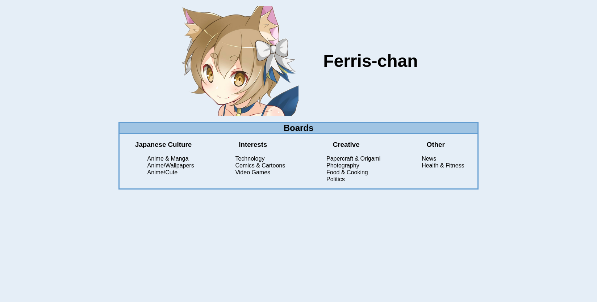
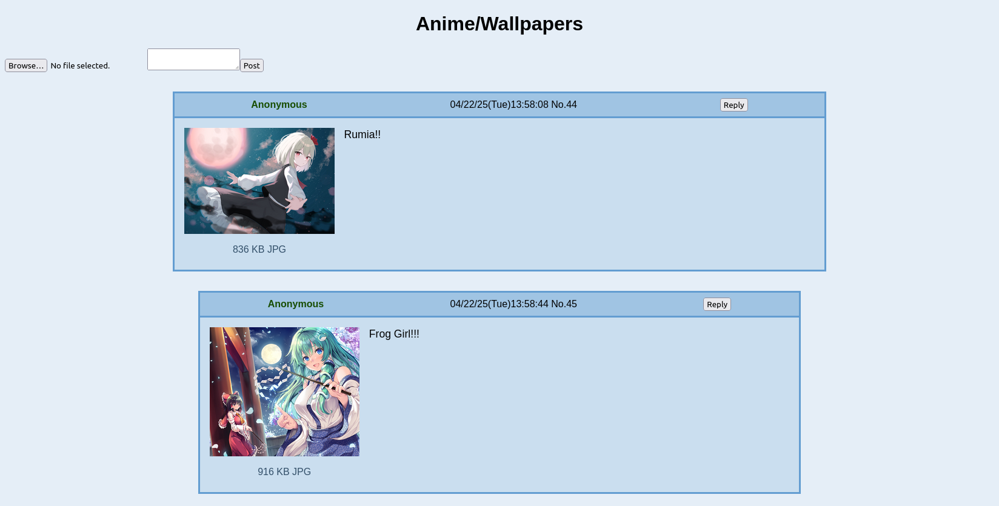
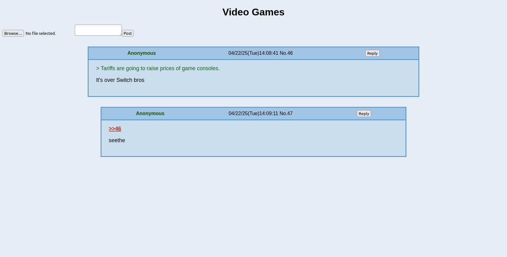

# Ferris-chan
An image board written in pure Rust split between a frontend and backend.

## How to run
1. First install Rust
2. Then install trunk with `cargo install trunk`
3. clone the repo
4. To start the server do `cargo run --bin ferris-backend`
5. To serve the frontend do `trunk serve --port 3001 --open` in `ferris-frontend` to open the webpage.

## Images
Things are still a work in progress and things chan change at any time.
#### Homepage

#### A Board

#### Supports quote texting and linking

### Credits
Logo belongs to user rakka (kagemyy) who you can find on [Pixiv here](https://www.pixiv.net/en/users/94880016) although the page for the artwork has been deleted for some time.
